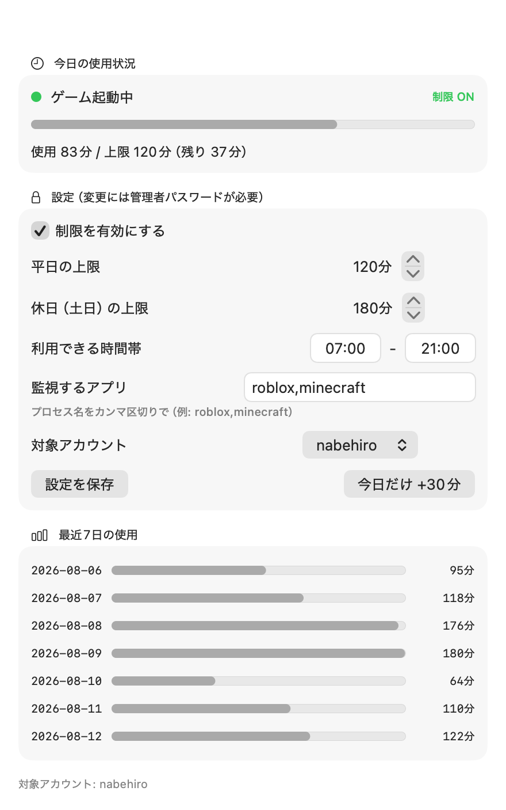

# PlayCap

**Mac の Roblox に「本当に効く」1日のゲーム時間制限 — デバイスレベルで強制。**

English: [README.md](README.md) / Setup: [INSTALL.en.md](INSTALL.en.md)



macOS のスクリーンタイムは Roblox を制限できないことで有名です（Mac App Store 外配布のため。
Apple Community には数百件の "me too" が付いたスレッドがあります）。Roblox 公式のペアレンタル
コントロールは、親がリンクした「その1つのアカウント」にしか効きません。しかも公式ヘルプに
明記されている通り、**13歳になると時間上限の設定権は子供本人に移り**、親にできるのは使用時間の
閲覧だけになります。さらに新しいアカウントは生年月日の入力だけで作れるため、リンクされていない
別アカウントには制限が一切かかりません。

PlayCap のアプローチは違います。Mac 本体に常駐する小さな root 監視プログラムがプレイ時間を
数え、時間が来たらゲームを終了させます — **どの Roblox アカウントでログインしていても**。

## 機能

- 1日のプレイ時間上限（平日 / 休日で別設定）
- トレイ常駐対応: 最近の Roblox はウィンドウを閉じても本体が常駐し続けますが、
  PlayCap は実際に遊んでいる時間（CPU 活動）だけをカウント。待機中の常駐プロセスで
  上限が減ることはありません
- 利用できる時間帯（例: 07:00 前と 21:00 以降は禁止）
- 残り10分・5分・1分で通知 → 上限でゲーム終了
- 「今日だけ +30分」ボーナス（翌日自動リセット）
- 直近7日の使用履歴表示
- プロセス名ベースで任意のアプリに対応（既定は `roblox`。`minecraft` 等を追加可）
- 日英 UI・通知（自動判定）
- **設定は親専用**: 変更には macOS の管理者パスワードが必須。子供は標準アカウントのため、
  監視の停止・設定変更・時計変更はできません
- テレメトリなし・通信なし・アカウント登録なし。すべて Mac 内で完結

## 仕組み

```
[root LaunchDaemon] 30秒ごと
      │
      ▼
[monitor.sh] ── プロセス名で pgrep（-f 不使用: ブラウザURLへの誤爆なし）
      │           ├─ 実際にプレイ中の時間だけ積算（CPU活動で判定。
      │           │   トレイ常駐のアイドルプロセスはカウントしない）
      │           ├─ 残り10/5/1分で子供のセッションに通知
      │           └─ 上限超過 / 時間帯外 → ゲームを終了
      ▼
[/Library/Application Support/PlayCap/]
      ├─ config / state / usage.log（root所有・読み取りは全員可）

[playcap] 設定CLI。参照は誰でも、変更は root のみ
[PlayCap.app] 親用GUI。変更は管理者認証ダイアログ経由
```

## インストール

[INSTALL.ja.md](INSTALL.ja.md) 参照。要約: お子さんの Mac で zip を展開 →
`Install.command` をダブルクリック → 管理者パスワード → お子さんのアカウントを選択。

要件: Apple Silicon Mac / macOS 14 以上 / お子さんのアカウントが標準ユーザーであること。

## ソースからビルド

すべてオープンソース（MIT）です。Command Line Tools があれば:

```bash
./gui/build.sh      # gui/dist/PlayCap.app を生成（Xcode 不要）
./package.sh        # dist/PlayCap-installer.zip を生成
bash tests/test_core.sh   # テストスイート（root 不要）
```

自分でビルドしたくない方向けに、テスト済みパッケージ + 図解セットアップガイドを
少額で販売しています — Releases ページ / 商品リンク参照。

## 正直な限界

- 技術に詳しい子はゲームのバイナリを別名コピーしてプロセス名照合をすり抜ける可能性が
  あります。報告されるプレイ時間が不自然に少なければ usage.log を確認してください
- 通知はベストエフォートです（初回に macOS の通知許可を求められる場合あり）。
  強制終了そのものは通知の成否に依存しません
- Roblox Corporation とは無関係の非公式ツールです。"Roblox" は Roblox Corporation の
  商標であり、ここでは互換性の説明のためにのみ使用しています

## ライセンス

MIT
