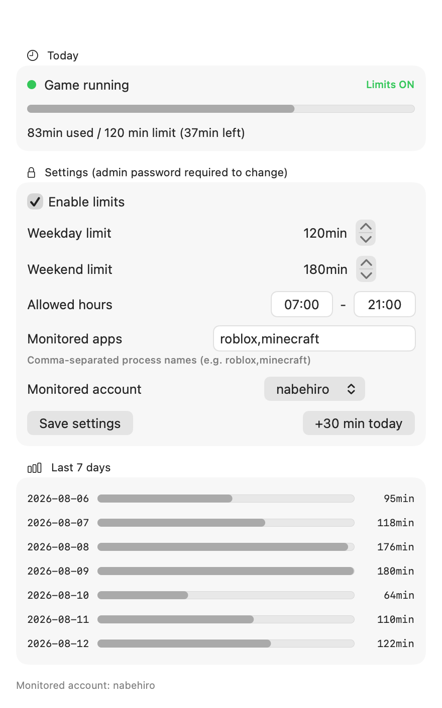

# PlayCap

**Daily game time limits for Roblox on Mac — enforced at the device level, so they actually work.**

日本語版: [README.ja.md](README.ja.md) / セットアップ: [INSTALL.ja.md](INSTALL.ja.md)



macOS Screen Time famously fails to limit Roblox (it is not a Mac App Store app — see the
Apple Community threads with hundreds of "me too"s). Roblox's own parental controls only
cover the single account a parent has linked — and per Roblox's own help center, at age 13
the child takes over the screen-time setting themselves ("At age 13, children directly manage
these settings: Screen time limits"); parents keep visibility, not control. Any new, unlinked
account (sign-up needs nothing more than a birthday) falls outside the limits entirely.

PlayCap takes a different approach: a tiny root-level monitor on the Mac itself counts play
time and quits the game when time is up — **no matter which Roblox account is logged in**.

## Features

- Daily play time limit (separate weekday / weekend settings)
- Tray-aware counting: modern Roblox keeps a resident process after you close the
  window — PlayCap counts only actual play (CPU activity), so idle tray time never
  burns the budget
- Allowed-hours window (e.g. nothing before 07:00 or after 21:00)
- Warnings at 10 / 5 / 1 minutes remaining, then the game quits
- "+30 min today" bonus button (auto-resets tomorrow)
- Last-7-days usage history
- Works for any app by process name (`roblox` by default; add `minecraft` etc.)
- English / Japanese UI and notifications (auto-detected)
- **Parent-only settings**: every change requires the macOS administrator password.
  The child uses a Standard account and cannot stop the monitor, edit settings, or
  change the clock
- No telemetry, no network access, no accounts. Everything stays on the Mac

## How it works

```
[root LaunchDaemon] every 30s
      │
      ▼
[monitor.sh] ── pgrep by process name (never -f: no false matches on browser URLs)
      │           ├─ counts time only during actual play (CPU-activity check:
      │           │   Roblox's idle tray-resident process doesn't count)
      │           ├─ notifies the child's session at 10/5/1 min remaining
      │           └─ over the limit / outside allowed hours → kills the game
      ▼
[/Library/Application Support/PlayCap/]
      ├─ config     (key=value, root-owned, world-readable)
      ├─ state      (today's seconds / bonus / warning stage)
      └─ usage.log  (daily history)

[playcap] settings CLI (symlinked to /usr/local/bin). Read for everyone, write = root only
[PlayCap.app] parent GUI. Changes go through the macOS admin-auth dialog
```

## Install

See [INSTALL.en.md](INSTALL.en.md). Short version: extract the zip on the child's Mac,
double-click `Install.command`, enter the admin password, pick the child's account.

Requirements: Apple Silicon Mac, macOS 14+, child account set to Standard (non-admin).

## Build from source

Everything is open source (MIT). With Command Line Tools installed:

```bash
./gui/build.sh      # builds gui/dist/PlayCap.app (no Xcode needed)
./package.sh        # builds dist/PlayCap-installer.zip
bash tests/test_core.sh   # runs the test suite (no root required)
```

Prefer not to build it yourself? **[Get the ready-made package ($9.99)](https://nabe16.gumroad.com/l/playcap)** —
prebuilt, tested, with an illustrated setup guide (English/Japanese) and email support.

## Honest limitations

- A technically savvy child could copy and rename the game binary to dodge process-name
  matching. Check usage.log if reported play time looks implausibly low
- Notifications are best-effort (macOS may ask for notification permission once);
  enforcement (quitting the game) does not depend on them
- Not affiliated with, endorsed by, or sponsored by Roblox Corporation.
  "Roblox" is a trademark of Roblox Corporation, used here only to describe compatibility

## License

MIT

- Privacy: [PRIVACY.md](PRIVACY.md) (100% offline, zero telemetry) / Terms: [TERMS.md](TERMS.md)
